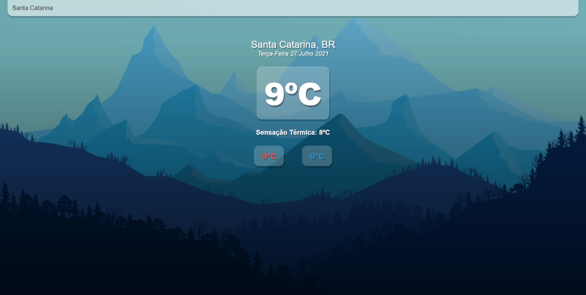

<h1 align="center">🌥️ Aplicativo de Climatempo</h1>

  <strong>App desenvolvido como forma de estudo em REACT e Consumo de API</strong>
   
  Ao digitar a cidade desejada, o aplicativo te mostra a temperatura atual, também como a sensação térmica e temperatura minima | máxima

  

  

  

### Site 💻

- [Clima Tempo App](https://climatempo-app.netlify.app/)

## Biblioteca: 📙
- REACT

## API: 🗃️
- https://openweathermap.org/api
